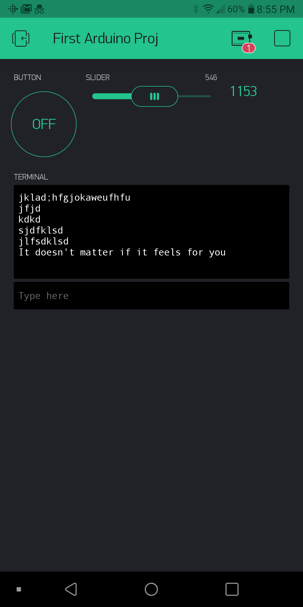

Name: Michael Chuang

EID: mrc4375

Team Number: F1
## Questions

1. What is the purpose of an IP address?

    answer It is the "Internet Protocal" Or the unique 32 bit number given to each machine so that it is recognizable

2. What is a DNS? What are the benefits of using domain names instead of IP addresses?

    answer A DNS is a Domain Name service which matches a symbolic name to an IP address. This helps us identify which IP address goes to what (since it is hard to memorize each number).

3. What is the difference between a static IP and a dynamic IP?

    answer A static IP address stays the same for each machine. On the other hand, a dynamic IP address means that a machine can have different IP addresses, which could change when they connect to different networks

4. What is the tradeoff between UDP and TCP protocols?

    answer UDP is faster than TCP, however it isn't as reliable as TCP and vice versa. This is because TCP needs an additional verification step to say something was recieved.

5. Why can't we use the delay function with Blynk?

    answer Blynk is Event based. Thus, a delay function will only mess up everything.

6. What does it mean for a function to be "Blocking"?

    answer It means it prevents anything else from happening while it is running. Thus, the function "blocks"

7. Why are interrupts useful for writing Non-Blocking code?

    answer Interrupts allow for productive work to be done only when it is ready. As a result, other pieces of code can run while the function is preparing the data to be processed. This means this code is now non-blocking

8. What is the difference between interface and implementation? Why is it important?

   answer An interface says what the function does while implementation actually explicity shows the steps involved in making the function work. This is important in terms of abstraction. It allows us reuse code that we've already written or other people wrote while only caring about what it does for us. It helps do complex functions without having to write down each step every time.

9. Screenshot of your Blynk App:

    
